# 🚀 Bot WhatsApp con IA usando n8n - Guía Completa

**Crea un chatbot inteligente con WhatsApp Business API + n8n + IA (Groq/OpenAI)**

*Material del webinar por [Freddy Salazar, AI Engineer](https://www.linkedin.com/in/freddy-dick-salazar-valverde/)*
---

## 📋 TABLA DE CONTENIDOS

1. [Requisitos Previos](#requisitos-previos)
2. [Configuración WhatsApp Business API](#configuración-whatsapp-business-api)
3. [Setup n8n Cloud](#setup-n8n-cloud)
4. [Configuración IA (Groq/OpenAI)](#configuración-ia)
5. [Creación del Bot (3 Nodos)](#creación-del-bot)
6. [Testing y Validación](#testing-y-validación)
7. [Troubleshooting](#troubleshooting)

---

## 🎯 REQUISITOS PREVIOS

### **Cuentas Necesarias:**
- ✅ Cuenta Facebook Developer
- ✅ Número de teléfono para WhatsApp Business
- ✅ Cuenta n8n Cloud (gratuita)
- ✅ Cuenta Groq (gratuita) o OpenAI (de pago)

### **Tiempo Estimado:**
- ⏱️ Setup inicial: 30-45 minutos
- ⏱️ Configuración bot: 15 minutos
- ⏱️ Testing: 10 minutos

---

## 📱 CONFIGURACIÓN WHATSAPP BUSINESS API
### **Paso 0: Crear Business Portfolio en Business Facebook**
1. **Ir a Meta for Developers:**
   ```
   URL: https://business.facebook.com
   ```

2. **Crear business portfolio:**
   - Clic en "Create a business portfolio"
   - Business portfolio name: `AI N8N`
   - First name|Last name: tus datos
   - Business email: tu email
   - Clic "Create"

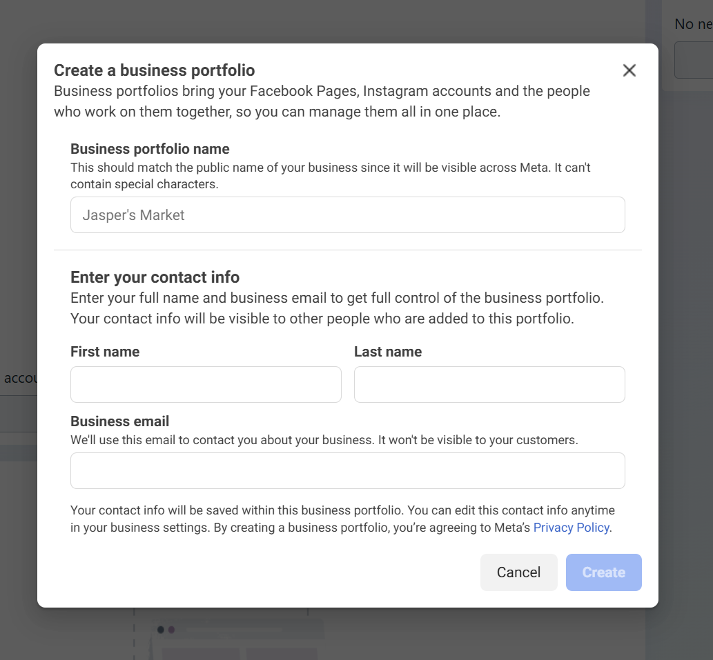

### **Paso 1: Crear App en Meta for Developers**

1. **Ir a Meta for Developers:**
   ```
   URL: https://developers.facebook.com
   ```

2. **Crear Nueva App:**
   - Clic en "Create App"
   - Nombre: `AI N8N`
   - Email de contacto: tu email
   - Seleccionar: **"Business"**
   - Clic "Create App"

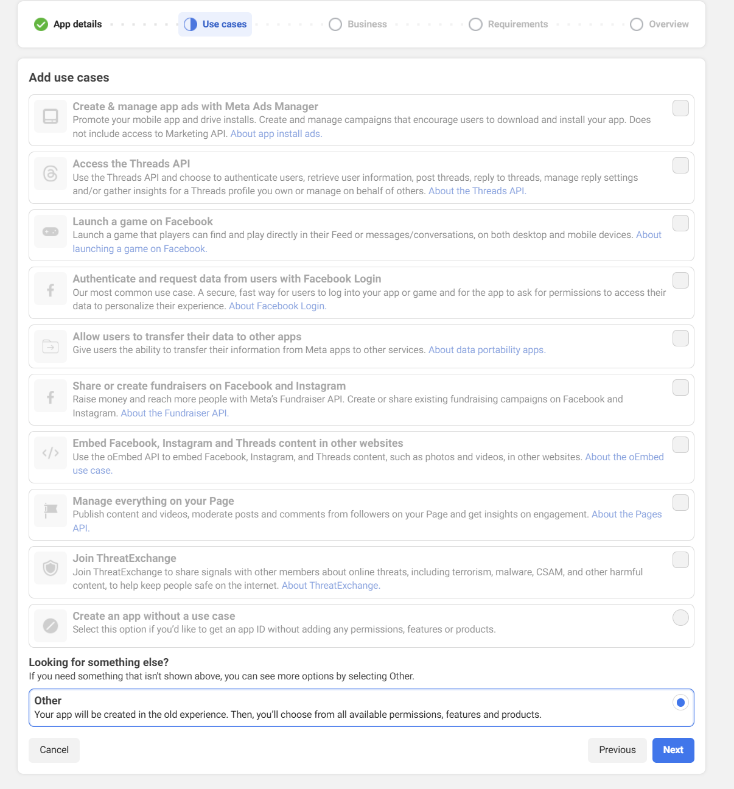

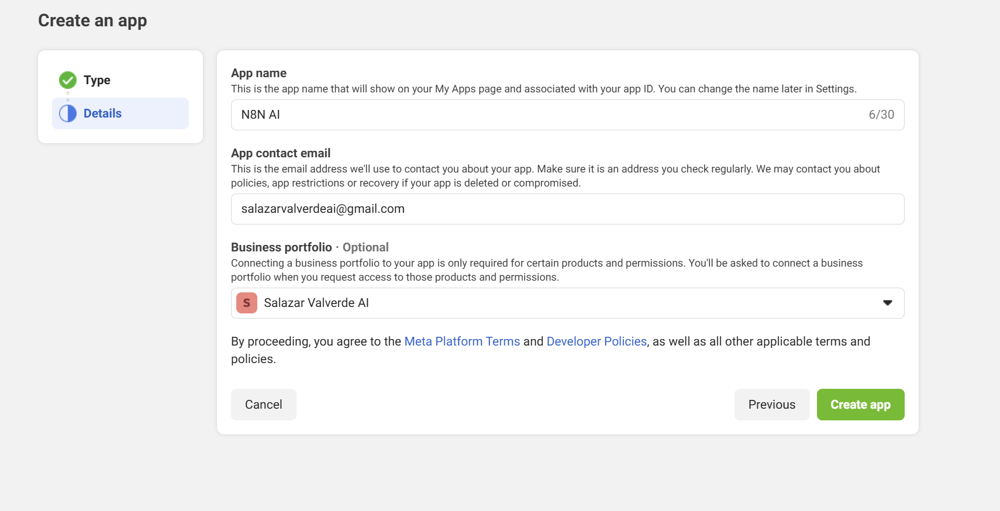

### **Paso 2: Agregar WhatsApp Product**

   - En el dashboard, buscar "WhatsApp"
   - Clic en "Set up" en WhatsApp

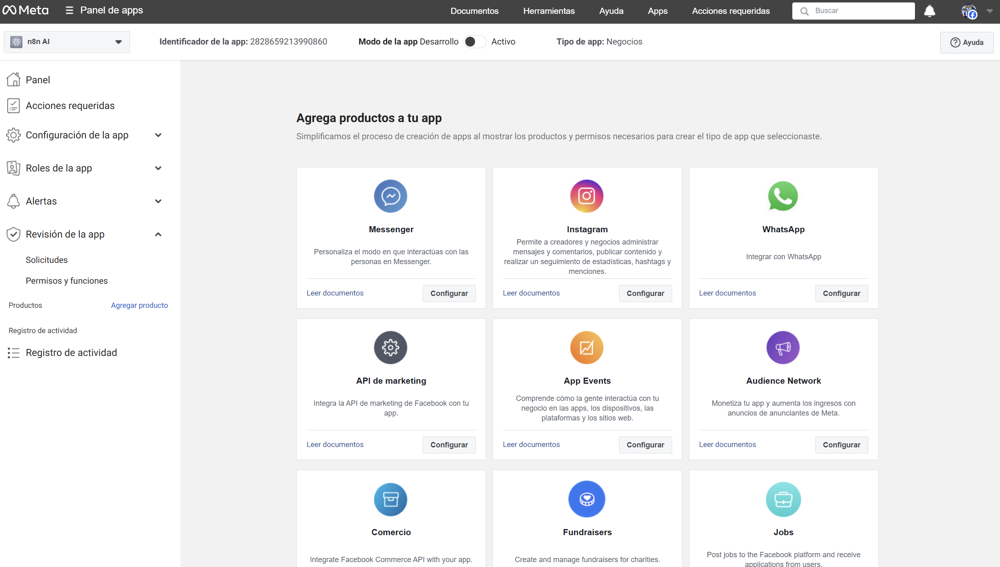

   - Luego en configurar API

### **Paso 3: Configurar Número de Prueba**

1. **Número de Prueba:**
   ```
   Por defecto Meta proporciona: +1 555-0199
   ```

2. **Agregar tu número como destinatario:**
   - Ir a "To" section
   - Clic "Manage phone number list"
   - Agregar tu número: `+51999888777` (ejemplo)
   - Verificar con código SMS


### **Paso 4: Obtener Credenciales**

1. **Temporary Access Token:**
   ```
   Ubicación: WhatsApp > API Setup > Temporary access token
   Formato: EAAx...
   Duración: 24 horas (para testing)
   ```

2. **Phone Number ID:**
   ```
   Ubicación: WhatsApp > API Setup > Phone number ID  
   Formato: 123456789012345
   ```

3. **Business Account ID:**
   ```
   Ubicación: WhatsApp > API Setup > WhatsApp Business Account ID
   Formato: 123456789012345
   ```

4. **App ID (N8N: App ID):**
   ```
   Ubicación: App Settings > Basic > App ID
   Formato: 123456789012345

5. **App secret (N8N: Client Secret):**
   ```
   Ubicación: App Settings > Basic > App secret


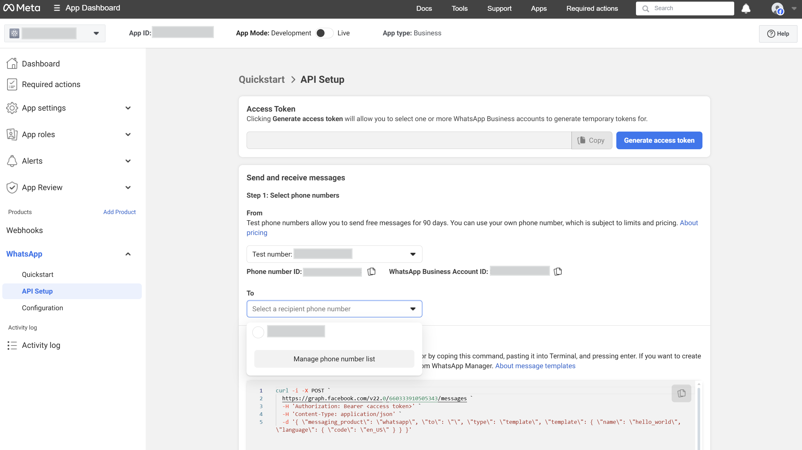
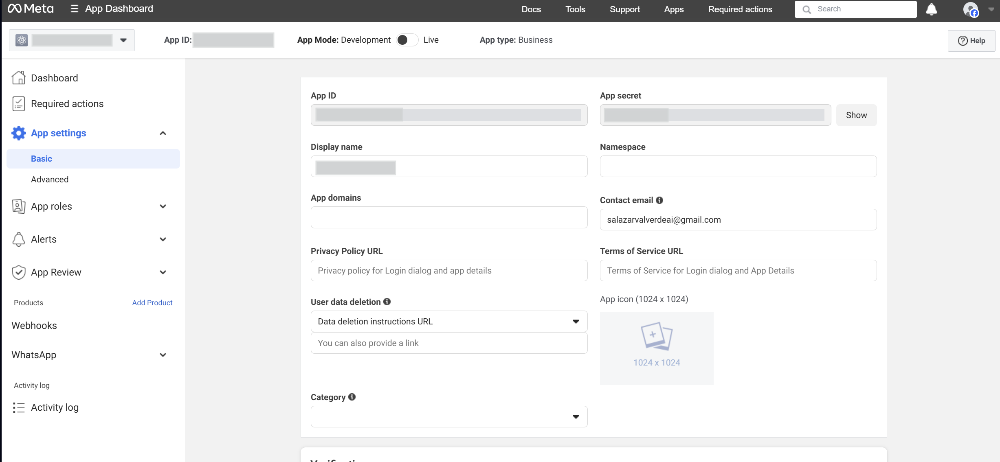

---

## ☁️ SETUP N8N CLOUD

### **Paso 1: Crear Cuenta**

1. **Registro:**
   ```
   URL: https://n8n.cloud
   Plan: Free (5,000 executions/month)
   ```

2. **Verificación:**
   - Confirmar email
   - Configurar workspace: "Mi Bot WhatsApp"

### **Paso 2: Crear Primer Workflow**

1. **Nuevo Workflow:**
   - Clic "Create new workflow"
   - Nombre: "WhatsApp Bot IA"
   - Guardar
---

## 🤖 CONFIGURACIÓN IA

### **Opción A: Groq (Recomendado - Gratis)**

1. **Crear cuenta:**
   ```
   URL: https://console.groq.com
   Plan: Free (30,000 tokens/día)
   ```

2. **Obtener API Key:**
   - Ir a "API Keys"
   - Clic "Create API Key"
   - Copiar key: `gsk_...`

### **Opción B: OpenAI (De Pago)**

1. **Crear cuenta:**
   ```
   URL: https://platform.openai.com
   Billing mínimo: $5 USD
   ```

2. **Obtener API Key:**
   - Ir a "API Keys"
   - Clic "Create new secret key"
   - Copiar key: `sk-...`

---

## 🔧 CREACIÓN DEL BOT (3 NODOS)


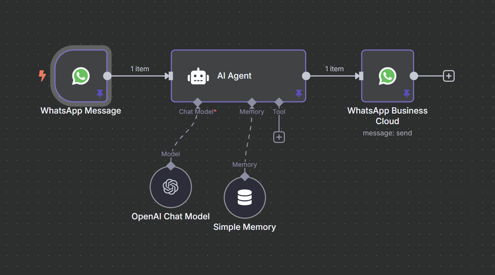

### **NODO 1: WhatsApp Message (Trigger)**

#### **Agregar Nodo:**
1. Clic en "+" para agregar nodo
2. Buscar: "WhatsApp Business Cloud"
3. Seleccionar: "On message received" (Triggers)

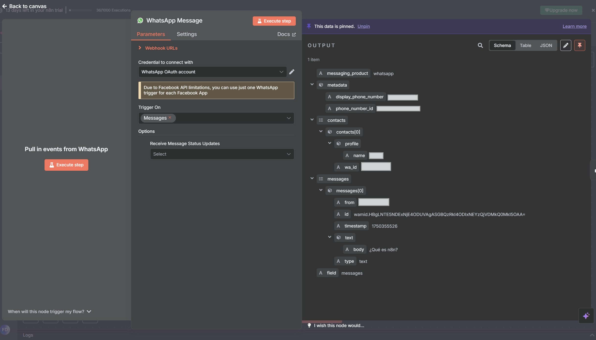

#### **Configurar Credenciales:**
1. **Crear nueva credencial:**
   - Credential Name: "WhatsApp Business"
   - Client ID: `...` (del Paso 4)
   - Client Secret: `...` (del Paso 5)

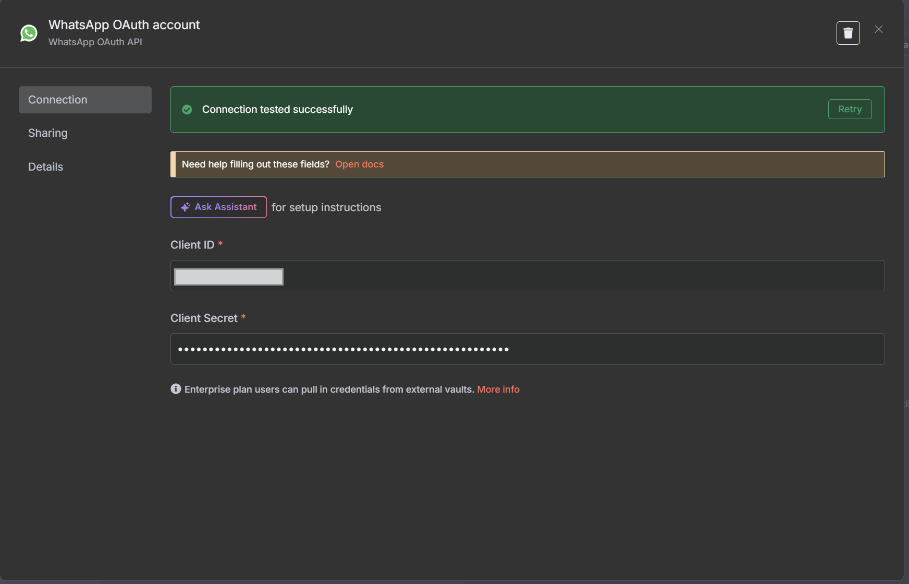

#### **Ejecutar y Probar:**
1. Clic "Execute Step"
2. Enviar mensaje WhatsApp a tu número de prueba
3. **Output esperado:**
   ```json
   {
     "messaging_product": "whatsapp",
     "metadata": {
       "display_phone_number": "1234",
       "phone_number_id": "1234"
     },
     "contacts": [
       {
         "profile": {
           "name": ""
         },
         "wa_id": "51987654321"
       }
     ],
     "messages": [
       {
         "from": "51987654321",
         "id": "wamid.HBgLNTE5NDExNjE4ODUVAgASGBQzRkI4ODIxNEYzQjVDMkQ0MkI5OAA=",
         "timestamp": "1750355526",
         "text": {
           "body": "¿Qué es n8n?"
         },
         "type": "text"
       }
     ],
     "field": "messages"
   }
   ```


---

### **NODO 2: AI Agent (Procesamiento)**

#### **Agregar Nodo:**
1. Conectar desde Nodo 1
2. Buscar: "AI Agent" (categoría AI)
3. Seleccionar "AI Agent"

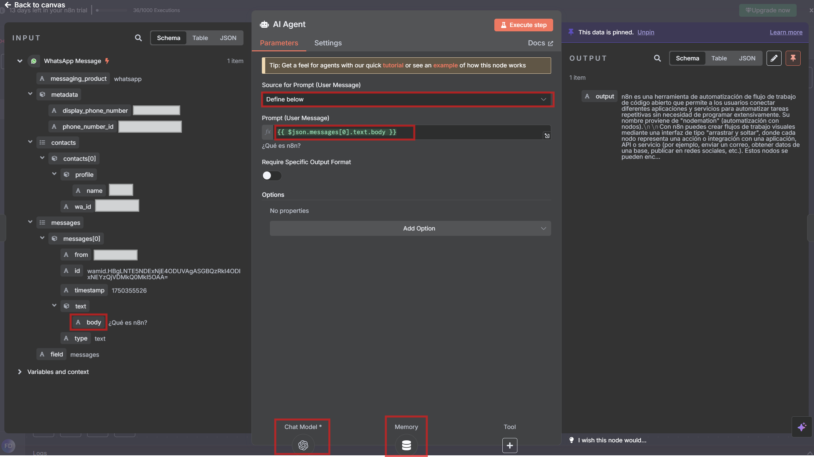

#### **Configurar Prompt:**
1. **Source for Prompt (User Message):**
   - Seleccionar: "Define below"
   - Seleccionar del input de la izquierda el body que contiene el texto
   - Debería quedar así:
   ```javascript
   {{ $json.messages[0].text.body }}
   ```

#### **Configurar Chat Model:**

**Para Groq:**
1. **Buscar en Chat Model:** "Groq Chat Model"
2. **Configurar credencial:**
   - Credential Name: "Groq API"
   - API Key: `gsk_...` (del paso anterior)
3. **Modelo:** `llama-3.1-8b-instant`

**Para OpenAI:**
1. **Buscar en Chat Model:** "OpenAI Chat Model"  
2. **Configurar credencial:**
   - Credential Name: "OpenAI API"
   - API Key: `sk-...` (del paso anterior)
3. **Modelo:** `gpt-4o-mini`

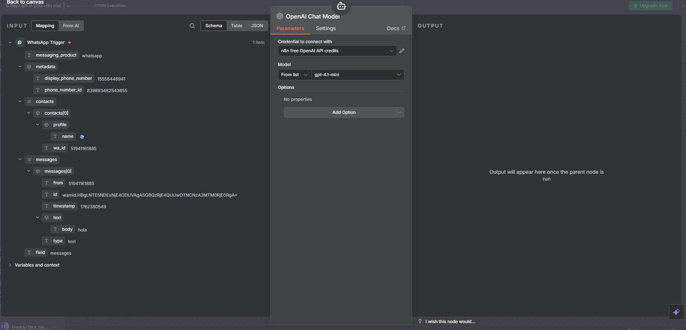


#### **Configurar Memory:**
1. **Agregar Simple Memory:**
   - Buscar "Simple Memory" en Memory
   - Session ID: "Define below"
   - En el campo escribir:
   ```javascript
   {{ $('WhatsApp Message').item.json.contacts[0].wa_id }}
   ```

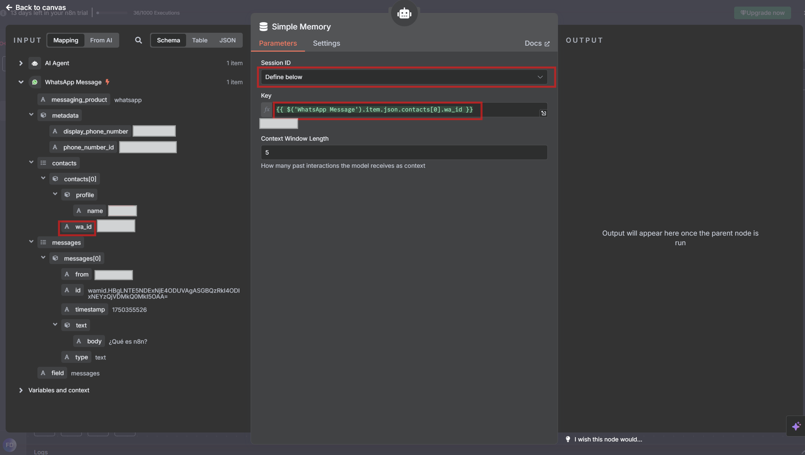

#### **Ejecutar y Probar:**
1. Clic "Execute Node"


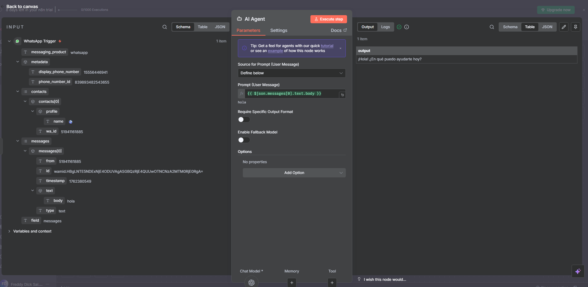

#### **Ejecutar Workflow:**

1. Regresa al workflow y dar a Execute Workflow, mostrará Waiting for trigger event

2. Enviar mensaje al número: ¿Qués es n8n?

3. Ingresar al nodo AI Agent

2. **Output esperado:**
   ```json
   {
     "output": "n8n es una herramienta de automatización de flujos de trabajo (workflow automation) de código abierto. Permite conectar diferentes aplicaciones, servicios y APIs..."
   }
   ```


---

### **NODO 3: WhatsApp Business Cloud (Envío)**

#### **Agregar Nodo:**
1. Conectar desde Nodo 2
2. Buscar: "WhatsApp Business Cloud"
3. Seleccionar: "Send message" (Message Actions)


#### **Configurar Credenciales:**
1. **Usar misma credencial** del Nodo 1 o crear nueva:
   - Access Token: `EAAx...`
   - Business Account ID: `123...`

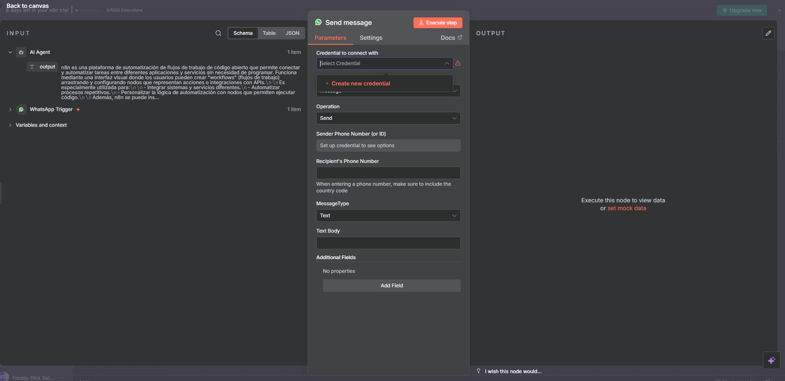
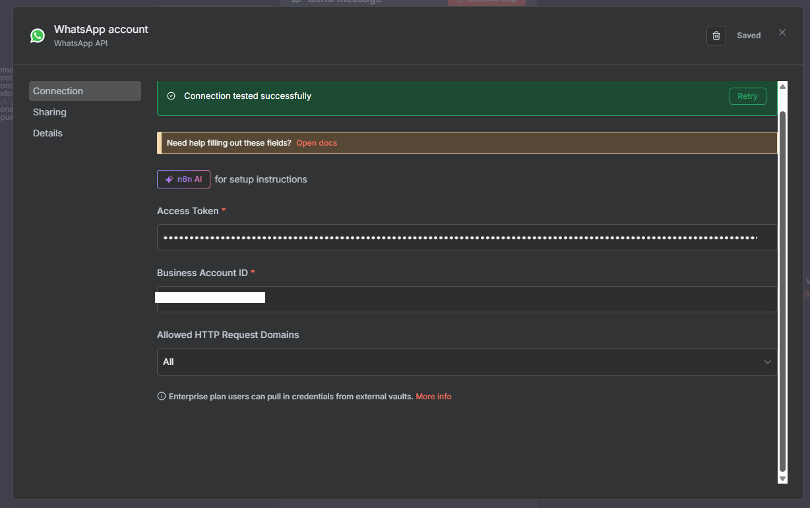

#### **Configurar Mensaje:**

1. **Sender Phone Number (or ID):**
   - Seleccionar el número de prueba: `987654321` 

2. **Recipient's Phone Number:**
   - Definir: "From another node's output"
   - Escribir:
   ```javascript
   {{ $('WhatsApp Message').item.json.contacts[0].wa_id }}
   ```

3. **Message Type:** Text

4. **Text Body:**
   - Definir: "Text Body"
   - Escribir:
   ```javascript
   {{ $json.output }}
   ```

#### **Ejecutar y Probar:**
1. Clic "Execute Node"
2. **Output esperado:**


---

## ✅ TESTING Y VALIDACIÓN

### **Flujo Completo:**

1. **Activar Workflow:**
   - Clic en toggle "Active" (arriba derecha)
   - Debe aparecer en verde

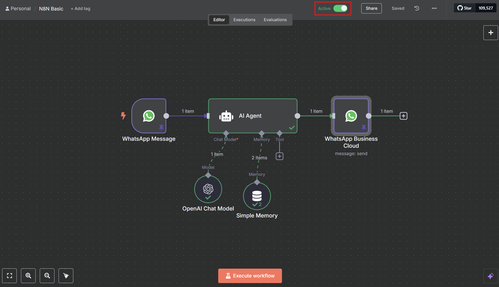

2. **Test End-to-End:**
   - Enviar mensaje WhatsApp: ""
   - Esperar respuesta automática del bot
   - Verificar en Executions que se ejecutó correctamente

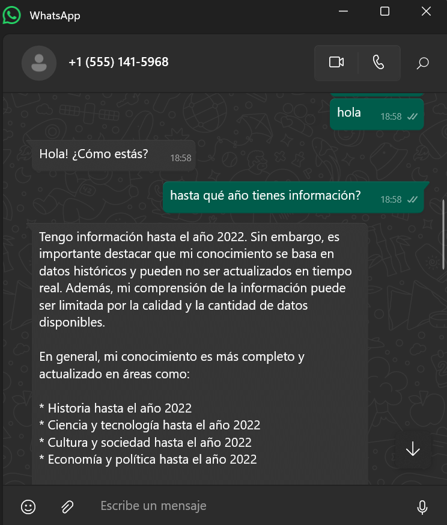

---

## 🔧 TROUBLESHOOTING

### **Problemas Comunes:**

#### **Error: "Invalid Access Token"**
```
Solución:
1. Verificar que el token no haya expirado (24h)
2. Generar nuevo token en Meta for Developers
3. Actualizar credencial en n8n
```

#### **Error: "Webhook verification failed"**
```
Solución:
1. Verificar Verify Token exacto en Meta
2. Confirmar URL webhook correcta
3. Reactivar webhook en Meta console
```

#### **No recibe mensajes:**
```
Solución:
1. Verificar que tu número está en lista de prueba
2. Confirmar webhook está activo
3. Revisar logs en Meta > Webhooks
```

#### **IA no responde:**
```
Solución:
1. Verificar API key válida (Groq/OpenAI)
2. Comprobar rate limits no excedidos
3. Revisar configuración del modelo
```

#### **Mensaje no se envía:**
```
Solución:
1. Verificar formato del número correcto
2. Confirmar permisos de la app
3. Revisar límites de mensajes por hora
```

---

## 📊 ARQUITECTURA FINAL

```
┌─────────────────┐    ┌──────────────┐    ┌─────────────────┐
│   WhatsApp      │───▶│  AI Agent    │───▶│   WhatsApp      │
│   Message       │    │              │    │   Business      │
│   (Trigger)     │    │ Groq/OpenAI  │    │   Cloud         │
│                 │    │ + Memory     │    │   (Send)        │
└─────────────────┘    └──────────────┘    └─────────────────┘
        ▲                       │                     │
        │                       ▼                     ▼
   📱 Usuario               🧠 Procesa              📱 Usuario
   envía mensaje           con IA                  recibe respuesta
```

---
## 📞 SOPORTE

### **Recursos Útiles:**
- 📚 [Documentación n8n](https://docs.n8n.io)
- 📱 [WhatsApp Business API Docs](https://developers.facebook.com/docs/whatsapp)
- 🤖 [Groq API Documentation](https://console.groq.com/docs)
- 🧠 [OpenAI API Reference](https://platform.openai.com/docs)

### **Comunidades:**
- 💬 [n8n Community](https://community.n8n.io)
- 🐛 [GitHub Issues](https://github.com/n8n-io/n8n/issues)
- 📺 [Canal YouTube n8n](https://www.youtube.com/c/n8n-io)

---

**¡Felicidades! 🎉 Has creado tu primer bot de WhatsApp con IA usando n8n.**

*Tiempo total invertido: ~60 minutos*  
*Costo: $0 (usando versiones gratuitas)*  
*Resultado: Bot conversacional inteligente*

---
